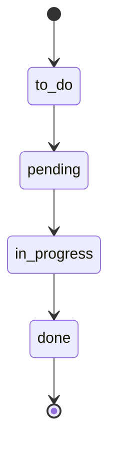
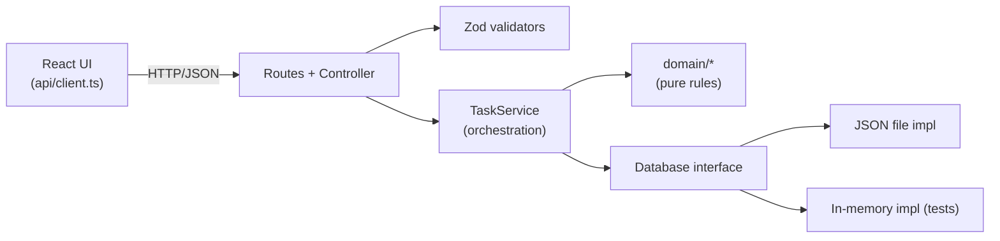

# Mini Task Manager

A small internal tool for managing simple tasks with a **clear, immutable audit
trail**. The goal is not to be feature‑rich, but to be **easy to reason about**:
every status change is explicit, attributable, and permanently recorded.

- **Frontend:** React + TypeScript (Vite)
- **Backend:** Node.js + Express + TypeScript
- **Persistence:** JSON file (behind a swappable `Database` interface)

## Production URLs

- App: https://mini-task-manager.bintangtobing.com
- API: https://mini-task-manager-api.bintangtobing.com/api

---

## Table of contents

- [Features](#features)
- [Tech stack](#tech-stack)
- [Project structure](#project-structure)
- [Getting started](#getting-started)
- [Available scripts](#available-scripts)
- [Configuration](#configuration)
- [Domain rules](#domain-rules)
- [API reference](#api-reference)
- [Architecture](#architecture)
- [Testing](#testing)
- [Assumptions](#assumptions)
- [Trade-offs](#trade-offs)
- [Security notes](#security-notes)
- [What I'd improve with more time](#what-id-improve-with-more-time)
- [Design questions (required answers)](#design-questions-required-answers)
- [AI usage disclosure](#ai-usage-disclosure)

---

## Features

- **Create** a task (starts in `to_do`).
- **Advance** a task's status along a strict workflow.
- **Delete** a task (its audit history is kept).
- **List** all tasks.
- **Per-task audit log** that records who changed what, when, and how — shown
  chronologically in an expandable section.

---

## Tech stack

| Layer       | Choice                              | Why                                                        |
| ----------- | ----------------------------------- | ---------------------------------------------------------- |
| Frontend    | React 18 + TypeScript + Vite        | Fast DX, type-safety, minimal config.                      |
| Backend     | Express 4 + TypeScript              | Small, explicit, ubiquitous.                               |
| Validation  | Zod                                 | Runtime validation that also produces TypeScript types.    |
| Persistence | JSON file behind a `Database` iface | Survives restarts, zero setup, trivially inspectable.      |
| Tests       | Vitest                              | Fast, TS-native, zero-config.                              |

No authentication, roles, or external services are required.

---

## Project structure

```
mini-task-manager/
├── package.json            # npm workspaces + root scripts
├── server/                 # Express + TypeScript API
│   ├── src/
│   │   ├── domain/         # Pure business rules (no framework, no I/O)
│   │   │   ├── status.ts   # Status enum + transition rules (the core logic)
│   │   │   ├── types.ts    # Task & AuditLog shapes
│   │   │   ├── actors.ts   # Hardcoded predefined users
│   │   │   └── errors.ts   # Typed domain errors
│   │   ├── persistence/
│   │   │   └── database.ts  # Database interface + JSON & in-memory impls
│   │   ├── services/
│   │   │   └── taskService.ts # Orchestrates tasks + audit logs atomically
│   │   ├── http/           # Express glue: routes, controller, validators, errors
│   │   ├── app.ts          # Express app factory
│   │   ├── index.ts        # Entry point
│   │   ├── seed.ts         # Sample data
│   │   └── config.ts
│   └── data/               # JSON data file lives here at runtime (gitignored)
└── client/                 # React + TypeScript UI
    └── src/
        ├── api/client.ts   # Typed fetch wrapper
        ├── hooks/useTasks.ts
        ├── components/     # CreateTaskForm, TaskList, TaskItem, AuditLogPanel, …
        ├── constants.ts    # Status labels/colors mirrored from the backend
        ├── types.ts        # API contract types
        └── App.tsx
```

---

## Getting started

### Prerequisites

- **Node.js >= 18** (uses `crypto.randomUUID` and `structuredClone`)
- npm (ships with Node)

### Install

From the repository root (npm workspaces installs both packages):

```bash
npm install
```

### Run in development

The backend auto-seeds sample data on first run, so the UI is never empty.

**Option A — one command (runs both):**

```bash
npm run dev
```

**Option B — two terminals (if you prefer separate logs):**

```bash
# terminal 1
npm run dev:server     # API on http://localhost:4000

# terminal 2
npm run dev:client     # UI on http://localhost:5173
```

Then open **http://localhost:5173**.

### Run in production mode

```bash
npm run build          # builds server (tsc) and client (vite)
npm run start --workspace server   # serves the API from dist/
npm run preview --workspace client # serves the built UI
```

---

## Available scripts

Run from the repository root:

| Script              | Description                                            |
| ------------------- | ------------------------------------------------------ |
| `npm run dev`       | Run API + UI together.                                 |
| `npm run dev:server`| Run only the API (watch mode).                         |
| `npm run dev:client`| Run only the UI (Vite dev server).                     |
| `npm run build`     | Type-check + build both packages.                      |
| `npm run test`      | Run the backend unit tests.                            |
| `npm run typecheck` | Type-check both packages.                              |
| `npm run seed`      | Reset the data file and re-create sample data.         |

---

## Configuration

Environment variables (see `server/.env.example` and `client/.env.example`):

| Variable       | Where    | Default                     | Purpose                          |
| -------------- | -------- | --------------------------- | -------------------------------- |
| `PORT`         | server   | `4000`                      | API port.                        |
| `CLIENT_URL`   | server   | `http://localhost:5173`     | Allowed CORS origin.             |
| `DB_FILE`      | server   | `server/data/db.json`       | Location of the JSON data file.  |
| `VITE_API_URL` | client   | `http://localhost:4000/api` | Base URL the UI calls.           |

---

## Domain rules

### Status workflow (strict, linear)

A task may only **advance one step at a time**. Skipping a step, moving
backwards, or leaving the terminal state is rejected.



### Idempotent updates

Setting a task to the status it **already has** is a successful no-op
(`HTTP 200`, `{ changed: false }`) and **does not** create a new audit log
entry.

### Audit log

Every meaningful change appends an immutable entry:

| Action           | `fromStatus` → `toStatus` |
| ---------------- | ------------------------- |
| `created`        | `null` → `to_do`          |
| `status_changed` | `X` → `Y`                 |
| `deleted`        | `X` → `null`              |

Logs are **append-only**: there is no code path, service method, or endpoint
that can update or delete an existing entry. Deleting a task keeps its logs
(each entry stores a snapshot of the task title so the history stays readable).

---

## API reference

Base URL: `http://localhost:4000/api`

| Method   | Path                      | Body                      | Success | Notes                                            |
| -------- | ------------------------- | ------------------------- | ------- | ------------------------------------------------ |
| `GET`    | `/meta`                   | —                         | `200`   | Status list + predefined actors (UI dropdowns).  |
| `GET`    | `/tasks`                  | —                         | `200`   | All tasks, oldest first.                         |
| `POST`   | `/tasks`                  | `{ title, actor }`        | `201`   | Creates a task in `to_do`.                       |
| `PATCH`  | `/tasks/:id/status`       | `{ status, actor }`       | `200`   | `{ task, changed }`. Idempotent on same status.  |
| `DELETE` | `/tasks/:id`              | `{ actor }`               | `200`   | Removes the task, keeps the audit log.           |
| `GET`    | `/tasks/:id/audit-logs`   | —                         | `200`   | Chronological log (works after deletion too).    |

### Error responses

All errors share the shape `{ "error": { "code", "message", "details?" } }`.

| Status | Code                 | When                                            |
| ------ | -------------------- | ----------------------------------------------- |
| `400`  | `VALIDATION_ERROR`   | Missing/invalid field, or unknown `actor`.      |
| `404`  | `NOT_FOUND`          | Task id does not exist.                          |
| `409`  | `INVALID_TRANSITION` | Illegal status change (skip / backwards).       |

### Examples

```bash
# Create
curl -X POST http://localhost:4000/api/tasks \
  -H 'Content-Type: application/json' \
  -d '{"title":"Prepare invoice","actor":"john.doe"}'

# Advance status
curl -X PATCH http://localhost:4000/api/tasks/<id>/status \
  -H 'Content-Type: application/json' \
  -d '{"status":"pending","actor":"jane.smith"}'

# Audit log
curl http://localhost:4000/api/tasks/<id>/audit-logs
```

---

## Architecture

The backend is layered so that **business rules never depend on Express or on
how data is stored**. Dependencies point inward.



Key ideas:

- **`domain/status.ts`** holds the single decision function
  `evaluateTransition(from, to)` returning `valid | noop | invalid`. It is pure
  and fully unit-tested.
- **`TaskService`** performs each mutation inside one `db.transaction(...)`, so
  the task change and its audit entry are written **together or not at all** —
  they can never drift out of sync.
- **`Database`** is an interface. The JSON implementation writes atomically
  (temp file + `rename`) and serializes writes with an in-process mutex.
  Swapping in SQLite/Postgres later means writing one new implementation, with
  zero changes to the domain or service code. An in-memory implementation backs
  the unit tests.
- **Frontend** treats the server as the source of truth: it re-fetches after
  each mutation rather than guessing the new state locally.

---

## Testing

```bash
npm run test
```

The backend tests (Vitest) focus on the parts that carry the most risk:

- **Status transitions** — valid steps, idempotent no-op, rejected skips and
  backward moves, terminal state.
- **`TaskService`** — a `created` log on creation, one log per real change,
  **no log on idempotent updates**, illegal transitions leave state untouched,
  and **deletion preserves the audit trail**.

Tests run against the in-memory `Database`, so they are fast and isolated.

---

## Assumptions

1. **No authentication.** As allowed by the brief, the "actor" is chosen from a
   hardcoded list via a dropdown ("Acting as …"). It is sent explicitly with
   every mutating request.
2. **Strict linear workflow.** `to_do → pending → in_progress → done`, one step
   at a time, no skipping, no going back. `done` is terminal.
3. **Creation and deletion are audit-worthy**, not just status changes — this
   gives a complete timeline ("when was it created / by whom"). Creation is
   logged as `null → to_do`, deletion as `currentStatus → null`.
4. **Delete is a hard delete of the task**, but its audit logs remain queryable
   forever (immutability requirement).
5. **Single-node deployment.** The JSON store assumes one server process (see
   risks below).

---

## Trade-offs

- **JSON file vs. database.** Chosen for zero-setup reviewability and because
  the dataset is tiny. The cost is that it does not scale to multiple processes
  and is not a "real" transactional store. The `Database` interface keeps the
  upgrade path cheap.
- **Re-fetch after mutation vs. optimistic updates.** Re-fetching is simpler and
  guarantees the UI matches the server. For a small list the extra request is
  negligible; optimistic updates would add complexity for little gain here.
- **Duplicated contract types (client & server).** A shared package would be the
  "correct" long-term answer, but TypeScript project references add build
  complexity that isn't worth it at this size. The types are intentionally kept
  identical and documented as such.
- **"Advance" button vs. free status dropdown.** Because the flow is strictly
  linear, the UI offers only the single valid next step. This makes the rule
  obvious and prevents most invalid attempts — while the **backend remains the
  real enforcer** (validated by tests and the `409` path).

---

## Security notes

- Runtime dependencies (`express`, `cors`, `zod`, `react`) are clean.
- `npm audit` reports advisories **only in dev tooling** (the Vite/Vitest
  `esbuild` dev-server advisory and `concurrently`'s `shell-quote`). These tools
  are never shipped to or run in production, so they do not affect the deployed
  app. In a real project I'd still pin patched versions via `overrides` or move
  off `concurrently`.
- CORS is restricted to the configured `CLIENT_URL` rather than left open.
- All input is validated with Zod at the HTTP boundary before reaching the
  domain.

---

## What I'd improve with more time

1. **Swap JSON for SQLite** (via the existing `Database` interface) to get real
   transactions and safe concurrent access.
2. **Extract a shared types package** so the client and server import one
   contract.
3. **Add real users + authentication/authorization** instead of a dropdown actor.
4. **Pagination & filtering** on `GET /tasks` and the audit log.
5. **API/integration tests** (supertest) and a small set of component tests.
6. **Optimistic UI updates** with rollback for snappier interactions.
7. **Tamper-evident audit log** (hash-chained entries) for stronger guarantees.

---

## Design questions (required answers)

### 1. How do you ensure the audit log cannot be modified?

Immutability is enforced by **design and by absence**, in layers:

- **No mutation path exists.** The service only ever **appends** to the log
  (`state.auditLogs.push(...)` inside a transaction). There is no update method,
  no delete method, and no HTTP endpoint that targets a log entry. You simply
  cannot reach one to change it.
- **Append-only writes.** New entries are pushed with a monotonically
  increasing `seq`; existing entries are never rewritten.
- **Atomic, consistent writes.** A status change and its log entry happen inside
  the same transaction, so a log can't be "adjusted" separately from the data it
  describes.
- **Snapshots.** Each entry stores the task title at the time, so deleting a
  task never forces us to touch or lose its history.

For a production system I'd add **tamper-evidence**: store logs in an append-only
database table whose write/update/delete grants are restricted at the DB level,
and chain each row with a hash of the previous one so any retroactive edit is
detectable.

### 2. Which part is riskiest with many concurrent users?

The **JSON-file persistence**. Each write is a read-modify-write of the whole
file. I serialize writes with an in-process mutex and write atomically
(temp-file + `rename`), which is correct for a **single** Node process — but it
**does not hold across multiple processes/instances**: two servers could
overwrite each other's file, and the whole-file write becomes a bottleneck under
load. The fix is a real database with row-level locking / transactions, which
the `Database` interface already makes a drop-in change.

### 3. If this grew into a large system, what would you refactor first, and why?

The **persistence layer**, first. It's the foundation everything else trusts for
consistency and durability, and it's the current scaling ceiling. I'd implement
the `Database` interface with SQLite/Postgres (proper transactions, indexes,
concurrent access), keeping the audit table append-only. Doing this first
unblocks everything else (auth, pagination, multi-instance deploys) and requires
**no changes to the domain or service layer**, which is exactly why those
boundaries were drawn this way.

### 4. If you used AI, which parts did it help with and how did you validate them?

See the dedicated section below.

---

## AI usage disclosure

AI (an in-editor coding assistant) was used as a pair-programmer to:

- **Scaffold boilerplate** — `package.json`/`tsconfig` setup, the Express glue,
  and the React component shells.
- **Draft the unit tests and this README** from an agreed design.

It was **not** used to decide the architecture blindly. The design decisions
(strict transition rules, the transaction-per-mutation consistency model, the
append-only audit approach, the `Database` abstraction) were chosen
deliberately and then implemented.

How the output was validated:

- **Unit tests pass** (`npm run test`) — including the idempotency, illegal
  transition, and "delete preserves logs" cases.
- **Type-checking passes** (`npm run typecheck`) for both packages with `strict`
  mode on.
- **Manual API smoke test** with `curl` covering the happy path plus the `409`
  (illegal transition) and `400` (unknown actor) paths, and confirming audit
  logs survive deletion.
- I read every line and can explain why each piece is there.
